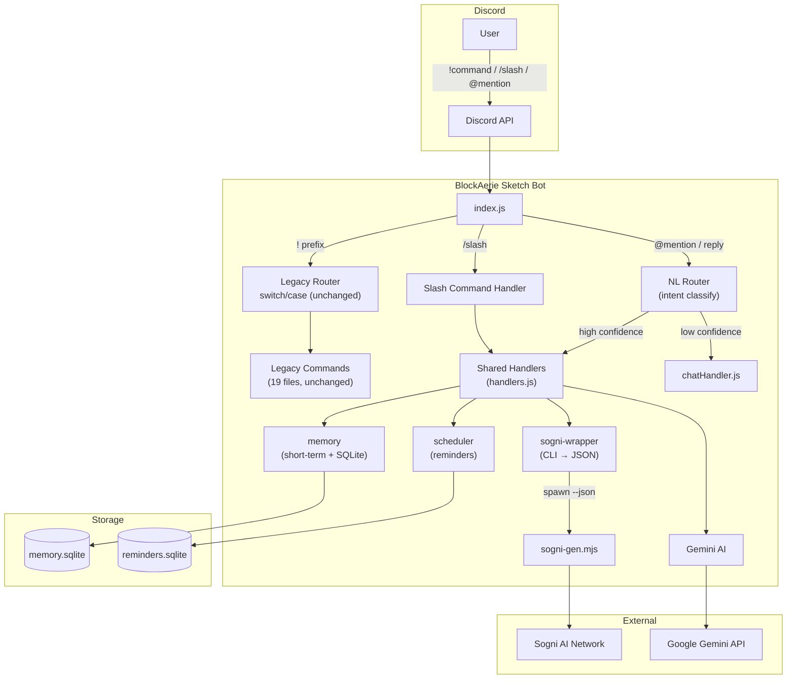

# Architecture

## Components

| Component | Location | Purpose |
|---|---|---|
| **Legacy Router** | `src/index.js` (unchanged) | Routes `!` prefix commands to existing handlers |
| **Slash Command Handler** | `src/slashCommands/handler.js` | Routes `/slash` commands to shared handlers |
| **NL Router** | `src/slashCommands/naturalLanguageRouter.js` | Classifies natural language → routes to shared handlers |
| **Shared Handlers** | `src/slashCommands/handlers.js` | Single logic path for all command execution |
| **Agent Core** | `packages/agent-core/` | Intent classification (regex + AI fallback) |
| **Sogni Wrapper** | `packages/sogni-wrapper/` | CLI wrapper around `sogni-gen.mjs --json` |
| **Memory** | `packages/memory/` | Short-term context (Map) + Long-term prefs (SQLite) |
| **Scheduler** | `packages/scheduler/` | Reminder scheduling with SQLite persistence |
| **Config** | `packages/config/` | Shared config layer (reads .env, provides defaults) |

## Data Flow

1. **Prefix commands** (`!imagine`, `!ban`, etc.) → Legacy router unchanged
2. **Slash commands** (`/imagine`, `/video`, etc.) → Interaction handler → Shared handlers
3. **Natural language** (`@bot make a cat image`) → NL Router → Intent classify → Shared handlers (if confidence ≥ 0.7) or fallback to chat
4. **Reminders** → Scheduler polls SQLite → Delivers to channel on fire time
